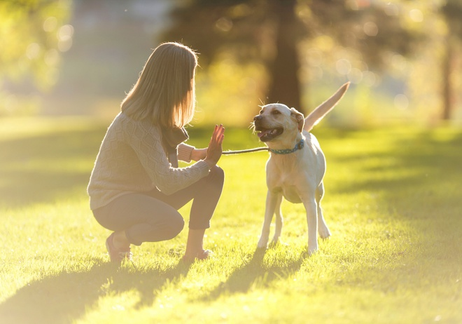
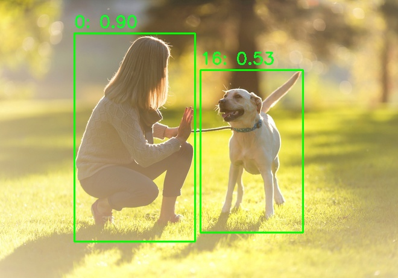

## Getting started after deploying DeepSparse Inference Runtime

After the [DeepSparse One-Click Droplet](<https://github.com/neuralmagic/deepsparse/blob/b028422aff667487e973eb99418907b765d283f4/examples/do-marketplace/README.md>) is created, access your Droplet via SSH by using your Droplet's IP address:<br>

`ssh root@<IP-ADDRESS> -L 5543:localhost:5543`

This command is used to establish a secure SSH tunnel and forward a port from a remote machine to your local machine.

As soon as you log in, you can use all of the DeepSparse features such as benchmarking, pipelines, and the server. Learn more about [DeepSparse's APIs here](<https://github.com/neuralmagic/deepsparse/blob/fd223aa935cef42c9c6dfcea62b14e003e0d6de5/docs/user-guide/README.md>).


## Machine Learning Inference on CPUs

DeepSparse enables developers of all experience levels to execute Deep Learning models for a diverse range of Natural Language Processing and Computer Vision tasks on CPUs.

Let's start using the [DeepSparse Server](https://github.com/neuralmagic/deepsparse/blob/main/docs/user-guide/deepsparse-server.md) to make predictions. This server has been optimized to handle machine learning inference. You ask it to make a prediction by sending an API request, and it sends the prediction back to you.

### YOLOv8 for Image Detection

Image detection is a common task from Computer Vision that focuses on finding and identifying specific objects within an image. It's like teaching a computer to "see" and recognize certain things in pictures. Let's say you have a photo that contains a cat, a dog, and a tree. Image detection would involve using a deep learning model to look at this photo and determine what objects are present.

For this task, we'll use a sparse YOLOv8, which is a state-of-the-art model for the image detection task.


**Step 1** From your Droplet's terminal, create a yaml file called `config.yaml` to configure the server. This file will select the YOLOv8 model and the class labels the model expects to classify objects in images:

```yaml
endpoints:
  - task: yolov8
    model: zoo:cv/detection/yolov8-s/pytorch/ultralytics/coco/pruned50_quant-none
    kwargs:
      class_names: "coco"
```

**Step 2** Initialize the DeepSparse Server with the config file:

```bash
deepsparse.server --config-file config.yaml
```

**Step 3** From your local machine's terminal, download the image `human-dog.jpg` into your working directory:

```bash
wget -O human-dog.jpg https://raw.githubusercontent.com/neuralmagic/deepsparse/main/docs/use-cases/cv/images/human-dog.jpg
```



**Step 4** On your local machine, use the Python `requests` library to make an API request to receive YOLOv8's inference on what it "sees" in the picture and then use the `opencv-python` library to draw objects in our image to know which objects it identified:

```python
import requests
import cv2

def draw_boxes_on_image(image_path: str, output_path: str, url: str):
    # Send the image to the server and get the response
    with open(image_path, "rb") as image_file:
        detections = requests.post(url, files={"request": (image_path, image_file)}).json()

    # Load and draw the bounding boxes on the image
    image = cv2.imread(image_path)
    for box, score, label in zip(detections['boxes'][0], detections['scores'][0], detections['labels'][0]):
        x1, y1, x2, y2 = box
        cv2.rectangle(image, (int(x1), int(y1)), (int(x2), int(y2)), (0, 255, 0), 2)
        cv2.putText(image, f'{label}: {score:.2f}', (int(x1), int(y1) - 10), cv2.FONT_HERSHEY_SIMPLEX, 0.9, (36, 255, 12), 2)

    # Save the image
    cv2.imwrite(output_path, image)

# Use the function
draw_boxes_on_image("human-dog.jpg", "human-dog-boxes.jpg", "http://0.0.0.0:5543/predict/from_files")
```

**Step 5** Call the function and pass in the image path, boxes-image path and the Server's url:

```
draw_boxes_on_image("human-dog.jpg", "human-dog-boxes.jpg", "http://0.0.0.0:5543/predict/from_files")
```

Here are all the objects identified by the model found in the new `human-dog-boxes.jpg` image:




### BERT for Sentiment Analysis

Sentiment analysis is a common task in Natural Language Processing that focuses on identifying and classifying opinions expressed in a piece of text. Imagine you're a business that receives thousands of social media comments and posts about your product every day. Sentiment analysis could involve using a machine learning model to process these social media interactions and determine the general sentiment towards your product — be it positive or negative.

For this task, we'll use a sparse BERT model, which is a transformer model for the sentiment analysis task. The model was trained to classify text into 2 sentiments: `positive` and `negative`. In addition, it also gives a score on how confident the model is in its prediction.

**Step 1** From your Droplet's terminal, initialize the DeepSparse Server with the BERT model:

```bash
deepsparse.server \
  --task sentiment_analysis \
  --model_path zoo:nlp/sentiment_analysis/obert-base/pytorch/huggingface/sst2/pruned90_quant-none
```

**Step 2** On your local machine's terminal, use `curl` to make an API request to receive BERT's inference on the sentiment of a tweet:

```bash
 curl -X POST -H "Content-Type: application/json" -d '{"sequences": "Hey @neuralmagic, DeepSparse is an an awesome piece of software!"}' http://localhost:5543/predict
```

output: `{"labels":["positive"],"scores":[0.9994332790374756]}`